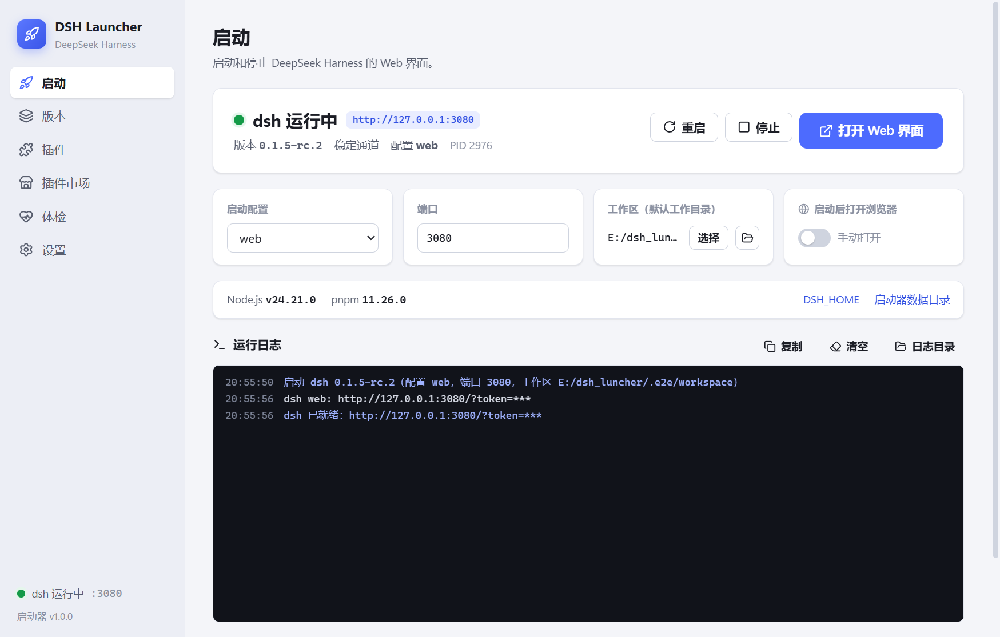
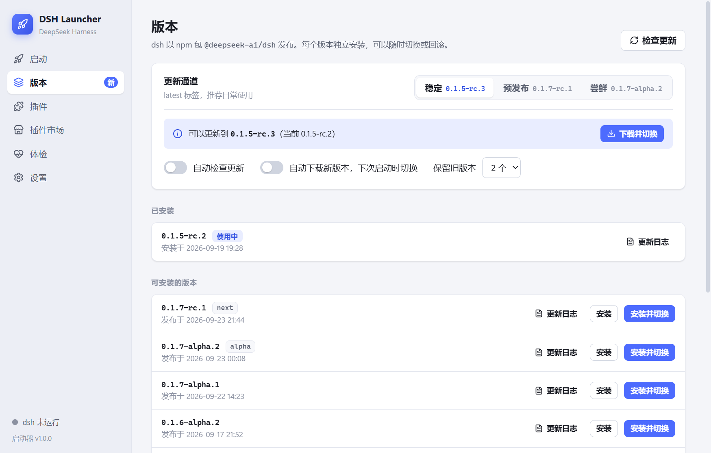
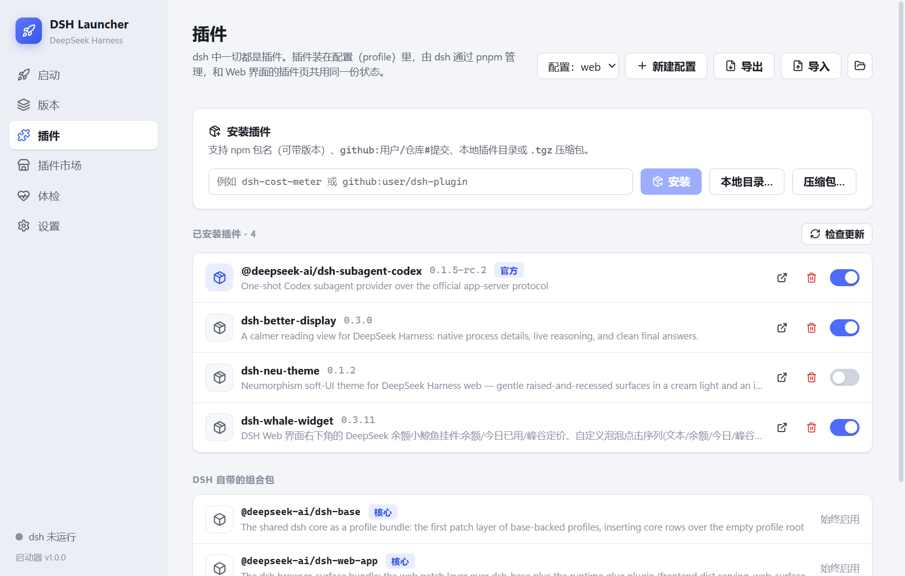
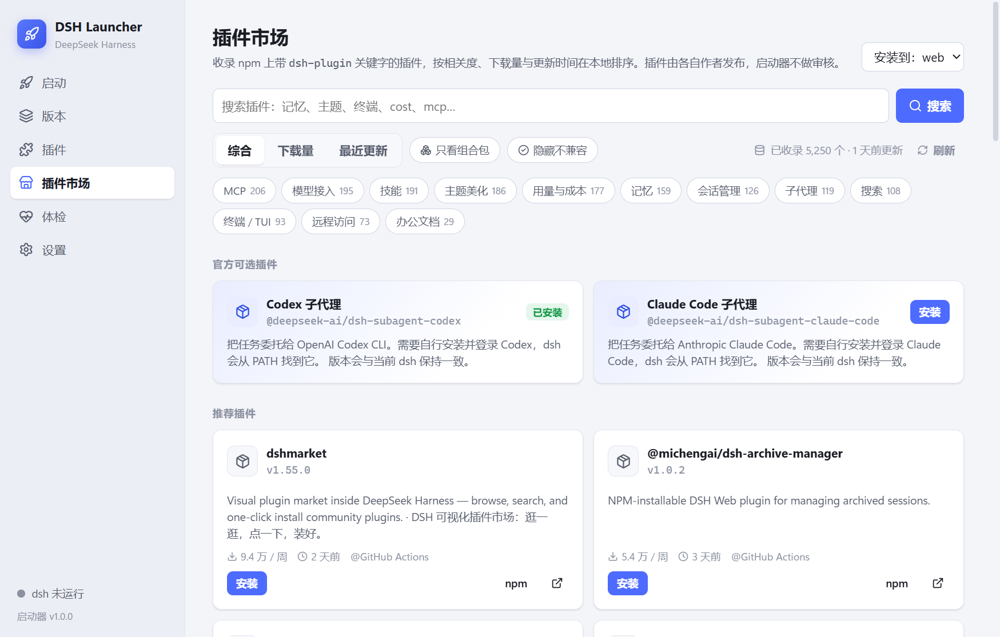
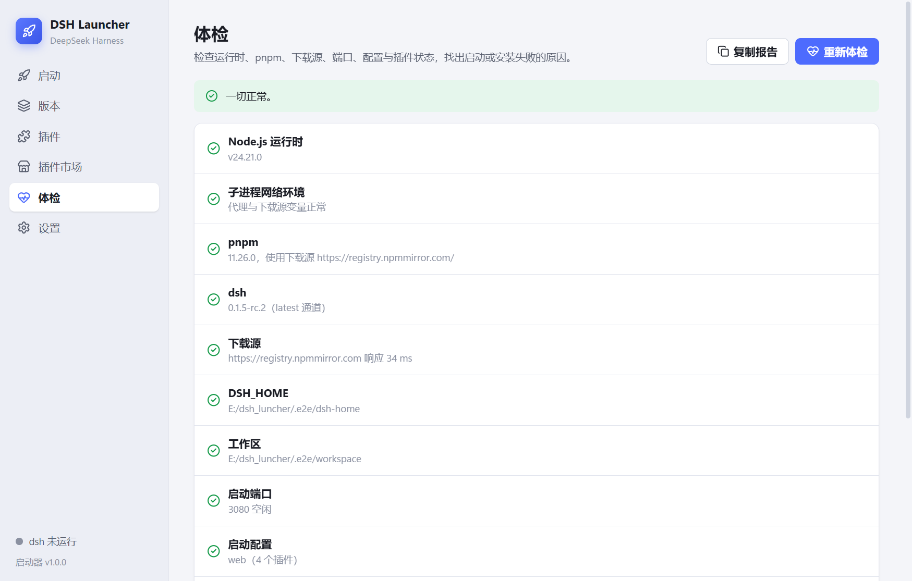

<div align="center">


# DSH Launcher

[DeepSeek Harness](https://github.com/deepseek-ai/deepseek-harness)（dsh）的中文桌面启动器

自动准备运行环境 · 多版本切换与回滚 · 插件安装与管理 · 插件市场 · 一键体检

[](https://github.com/zhw000/deepseek-harness-launcher/releases/latest)
[](LICENSE)
[](https://github.com/zhw000/deepseek-harness-launcher/releases/latest)

**[⬇ 下载最新版](https://github.com/zhw000/deepseek-harness-launcher/releases/latest)**



</div>

## 它解决什么问题

dsh 以 npm 包发布，自己用起来需要：装对版本的 Node.js（`^22.19` 或 `>=24`）、装 pnpm 11 才能管理插件、在命令行里 `dsh web`、手动处理 token 登录地址，插件出问题时还得去翻日志。DSH Launcher 把这些都收进一个窗口：

- **不需要预先装任何东西**：Node.js LTS（SHA-256 校验）和 pnpm 都由启动器下载到自己的目录，不改动系统环境。
- **不绑定某个 dsh 版本**：直接安装 npm 上官方发布的版本，`latest` / `next` / `alpha` 三个通道随意切换，多版本并存、随时回滚。
- **插件装得上、坏了修得好**：安装、更新、启停、导入导出都有界面；dsh 因插件启动失败时能指认是哪个插件并一键停用。

## 下载

到 [Releases](https://github.com/zhw000/deepseek-harness-launcher/releases/latest) 下载其中一个：

| 文件 | 适合 |
|---|---|
| `dsh-launcher-<版本>-setup.exe` | 安装版。当前用户安装，可选安装目录，带开始菜单和桌面快捷方式，卸载干净。 |
| `dsh-launcher-<版本>-portable.exe` | 免安装单文件。双击即用，所有数据放在 exe 旁边的 `dsh-launcher-data/`，适合 U 盘或非系统盘。 |

> 安装包**没有代码签名**，首次运行时 Windows SmartScreen 会提示“已保护你的电脑”，点「更多信息 → 仍要运行」即可。

首次打开点「一键安装」，启动器会依次下载 Node.js、pnpm 和 dsh（国内默认走 npmmirror 镜像，约半分钟），然后点「启动 dsh」即可在浏览器里用上 dsh。

## 功能

### 启动与守护

启动、停止、重启 `dsh web`，实时显示日志。dsh 打印的一次性登录地址（`/?token=…`）会被自动捕获并用来打开浏览器，日志里的 token 一律显示为 `***`。端口被占用时自动换用下一个空闲端口；退出时让 dsh 走它自己的优雅收尾，不留孤儿进程。可以设置**开机自动运行**（静默到托盘）和**打开启动器时自动启动 dsh**。

### 版本管理



三个更新通道、每个版本的发布时间与 GitHub 更新日志、一键安装并切换。可以开启自动检查与后台下载，下次启动时自动切到新版本；旧版本按设定数量保留，正在用的永远不会被清理。

### 插件管理



- 支持 npm 包名（可带版本）、`github:用户/仓库#提交`、本地插件目录、`.tgz` 压缩包。
- 检查更新时会读取**目标版本**声明的兼容范围，更新前就能看出新版是否支持当前 dsh。
- 官方 `@deepseek-ai/*` 插件自动锁定到当前 dsh 版本（它们与 dsh 同步发布，`latest` 标签常常落后）。
- 连续安装多个插件会**合并成一次 pnpm 运行**，而不是排队各跑一遍。
- pnpm 拦截依赖的构建脚本时，可以「允许构建」或「不运行」，两者都能解除阻塞。
- **导出 / 导入插件列表**：换电脑或重装后一次装回，也能直接读另一台电脑 dsh 配置目录里的 `package.json`。

### 插件市场



npm 的搜索接口几乎不提供可用的排序信号（质量分全为 1.0），中文查询也排不出东西，所以启动器把 npm 上带 `dsh-plugin` 关键字的全部插件（约 5 千个）索引到本地，自己召回和排序：

- 中文、英文都能搜，多个词取交集，英文按整词匹配。
- 精确包名优先；没声明关键字的插件、scoped 包也能按名字找到。
- 按综合 / 下载量 / 最近更新排序，可只看组合包、隐藏与当前 dsh 不兼容的插件，也可以按话题（MCP、记忆、主题、终端…）浏览。
- 安装前显示：是否为组合包、兼容性、是否含安装脚本、是否已弃用、作者是否已迁移到新包。

### 体检



启动失败、插件装不上、下载很慢时先点一下「开始体检」：检查运行时、pnpm、dsh、子进程网络环境、下载源延迟、目录权限、端口、启动配置、待决的构建脚本和插件兼容性。有问题的项直接跳到能修它的页面；「复制报告」可以贴到 issue 里。设置页还可以对各下载源**测速**，挑最快的那个。

## 常见问题

**和 DeepSeek 官方桌面端、社区的 dsh-desktop 有什么区别？** 它们把某个固定版本的 dsh 打包进应用；本启动器不打包 dsh，而是安装 npm 上的官方发布版本，所以能在通道之间切换、装历史版本、随时回滚。

**为什么浏览器打开的地址带 `?token=`？** 这是 dsh 自己的一次性登录令牌，用来换取 30 天的 `dsh-auth` cookie；直接访问 `http://127.0.0.1:3080/` 会返回 401。

**插件装到哪里了？** 装进所选配置的目录 `$DSH_HOME/profiles/<配置>`，由 dsh 通过 pnpm 管理。启动器执行的就是 `dsh plugin --profile <配置> add …`，和 dsh Web 界面的插件页共享同一份状态。

**安装插件为什么要半分钟？** 每次 `pnpm add` 都要完整解析依赖并做一次 pnpm 11 的供应链校验，依赖多的配置一次就要半分钟左右。连续安装会合并成一次运行；任务面板会显示当前处于哪个阶段。如果频繁出现 ETIMEDOUT，去设置里测速换源。

**提示“pnpm 拒绝运行依赖的构建脚本”怎么办？** pnpm 11 在有依赖的构建脚本未决定时，会让这个配置下的**所有安装都失败**。在插件页的提示条里选「允许构建」（同意这些包以你的权限执行脚本，不在 agent 沙箱内）或「不运行」（照常安装，纯 JS 插件通常不受影响）。

**插件改动后要重启吗？** 要。组合包的启用状态在 dsh 启动时确定，界面会提示并提供「立即重启」。

**dsh 启动失败了？** 启动页会显示真正的错误信息；如果是某个插件导致的，会直接给出「停用该插件并重启」。插件常因 dsh 升级而失效，先到插件页检查更新。

## 数据放在哪里

| 位置 | 内容 |
|---|---|
| `%LOCALAPPDATA%\dsh-launcher` | 启动器设置、Node.js、pnpm、各版本 dsh、运行日志、插件索引缓存 |
| `~/.dsh`（即 `$DSH_HOME`） | dsh 自己的会话、设置、凭据、配置与插件 |

- 免安装版的数据放在 exe 旁边的 `dsh-launcher-data/`。
- 设置环境变量 `DSH_LAUNCHER_DATA` 可以指定启动器数据目录；「设置 → 路径」里可以改 `DSH_HOME`，规则与 dsh 命令行一致。
- 设置里的环境变量（如 `DEEPSEEK_API_KEY`）用系统凭据加密后保存。

## 从源码构建

需要 Node.js 22.19+ 或 24+。

```bash
npm install
npm run dev
```

```bash
npm run typecheck   # 主进程 + 界面类型检查
npm test            # 单元测试
npm run test:e2e    # 端到端：真实下载、真实 dsh、独立的 DSH_HOME
npm run dev:web     # 只跑界面，用内置的模拟后端，方便走查
npm run dist        # 生成安装包和免安装版到 release/
```

核心逻辑在 `src/main/core`，都是不依赖 Electron 的普通 Node 模块，下载、安装、插件操作、进程管理都能在测试里对真实的 npm 和 dsh 跑通。设计与取舍见 [docs/DESIGN.md](docs/DESIGN.md)，版本变化见 [CHANGELOG.md](CHANGELOG.md)。

## 协议

[MIT](LICENSE)。本项目是社区作品，与 DeepSeek 官方无关联。
